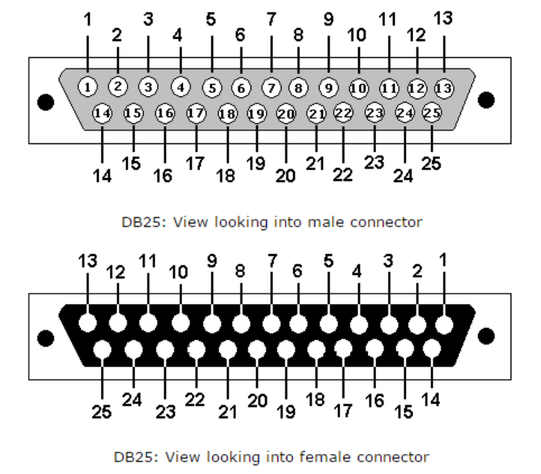

# NOAMcnc

This is general purpose CNC machine that can be made using a 3D printer and commonly available parts.

## Connector Pinout

The very in-expensive DB25 pin connector can control 5 motors and 4 limit switches.

Here is the pin layout.

| Pin | Description   | Pin | Description   | Pin | Description  | Pin | Description |
|-----|---------------|-----|---------------|-----|--------------|-----|-------------|
| 1   | X winding A1  | 9   | Y winding A1  | 17  | Z winding A1 | 25  | Ground      |
| 2   | X winding A2  | 10  | Y winding A2  | 18  | Z winding A2 |     |             |
| 3   | X winding B1  | 11  | Y winding B1  | 19  | Z winding B1 |     |             |
| 4   | X winding B2  | 12  | Y winding B2  | 20  | Z winding B2 |     |             |
| 5   | X2 winding A1 | 13  | Y2 winding A1 | 21  | X limit      |     |             |
| 6   | X2 winding A2 | 14  | Y2 winding A2 | 22  | X2 limit     |     |             |
| 7   | X2 winding B1 | 15  | Y2 winding B1 | 23  | Y limit      |     |             |
| 8   | X2 winding B2 | 16  | Y2 winding B2 | 24  | Y2 limit     |     |             |